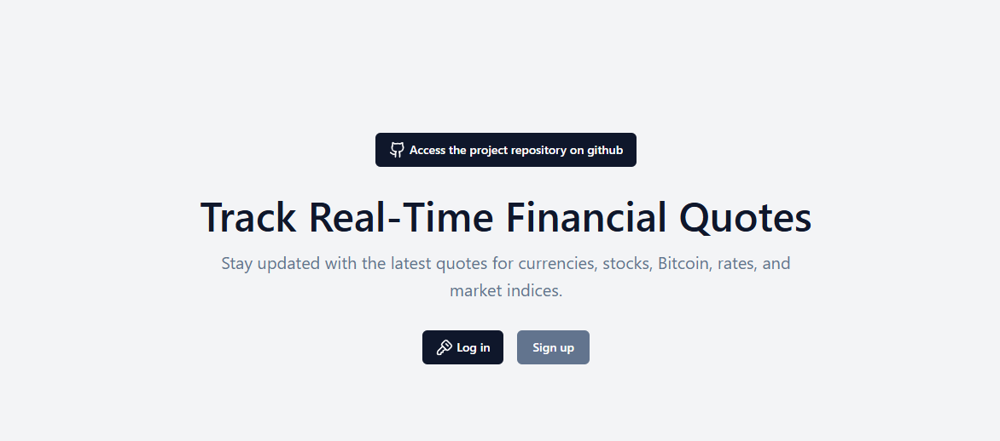
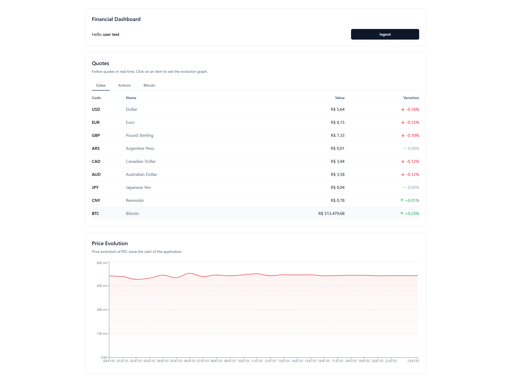

## 🚀 Franq Open Banking Frontend Challenges

Este projeto foi desenvolvido como parte de um desafio de frontend, utilizando tecnologias modernas para criar uma aplicação responsiva e eficiente:

- **Vite**: Ferramenta de build rápida e moderna.
- **React**: Biblioteca JavaScript para construção de interfaces de usuário.
- **TypeScript**: Superset do JavaScript que adiciona tipagem estática ao código.
- **Tailwind CSS**: Framework de CSS utilitário para criação de layouts responsivos.
- **Tailwind Merge**: Utilitário para mesclar classes do Tailwind CSS.
- **React Query**: Gerenciamento de estado assíncrono e cache de dados.
- **Storybook**: Ferramenta para desenvolvimento de componentes isolados.
- **Storybook**: Ferramenta para desenvolvimento de componentes isolados.
- **React Hook Form**: Biblioteca para gerenciamento de formulários.
- **Zod**: Biblioteca para validação e tipagem de dados.
- **Lucide React**: Ícones modernos e personalizáveis para React.

## Como Executar o Projeto

### Configure as Variáveis de Ambiente
Para consumir a API de dados financeiros, você precisará de uma chave de acesso fornecida pelo HG Brasil.

Siga os passos abaixo:

Acesse a [documentação oficial do HG Brasil ](https://console.hgbrasil.com/documentation/finance#obter-todos-os-dados) para entender como obter uma chave de API.

Crie uma conta no HG Brasil Console e gere sua chave de API.

Crie um arquivo .env na raiz do projeto e adicione a seguinte variável:

`VITE_HGBRASIL_API_KEY=SUA_CHAVE_DE_API`

Substitua SUA_CHAVE_DE_API pela chave gerada no console do HG Brasil.

| Comando          | Ação                                                         |
| :--------------- | :------------------------------------------------------------- |
| `pnpm install`   | Instala as dependências                                         |
| `pnpm run dev`       | Inicia o servidor de desenvolvimento local|
| `pnpm run build`       | Gera a build de produção do projeto.|
| `pnpm run test`       | Executa os testes do projeto.|
| `pnpm run storybook`       | Inicia o Storybook para desenvolvimento de componentes isolados.|

## Visualizar o Projeto

Você pode visualizar o projeto em produção no seguinte link:

[Visualizar Projeto](https://franq-open-banking-frontend-challenges.vercel.app/)

